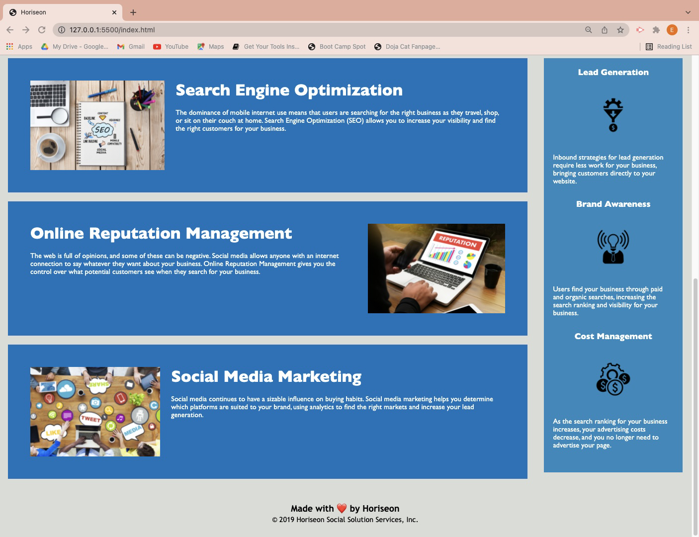

# hw-1-code-refactor

## OVERVIEW
The aim of this project was to refactor the Horiseon website code to make it more user friendly and semantic.

## CHANGES
* Added a Website Title
* Added Alt comments to the images
* Removed excess '
' tags
* Added comments to HTML and CSS files
* Removes excess classes
* Removes excess and repeated lines of code from CSS file
* Rearrange the line of code on the CSS file to flow chronologically

## SCREENSHOTS

## LINK TO DEPLOYED PAGE

 https://ebere-code.github.io/hw-1-code-refactor/